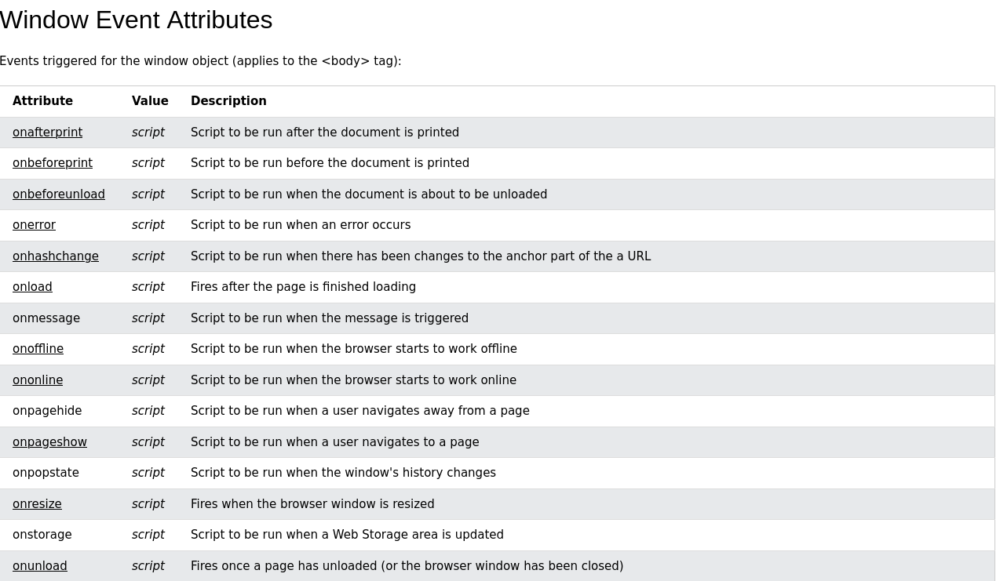
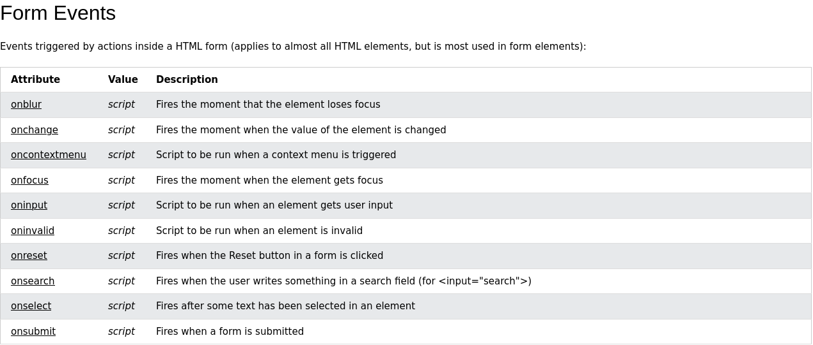
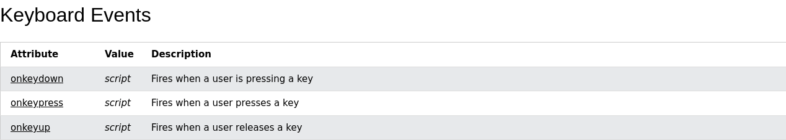
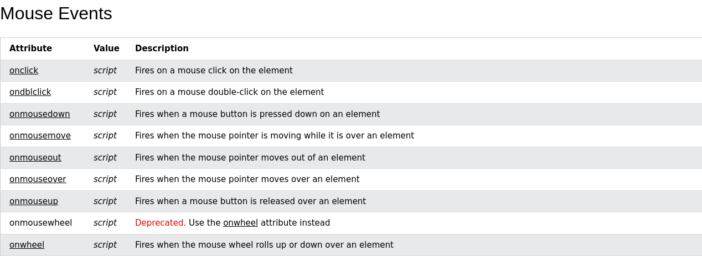
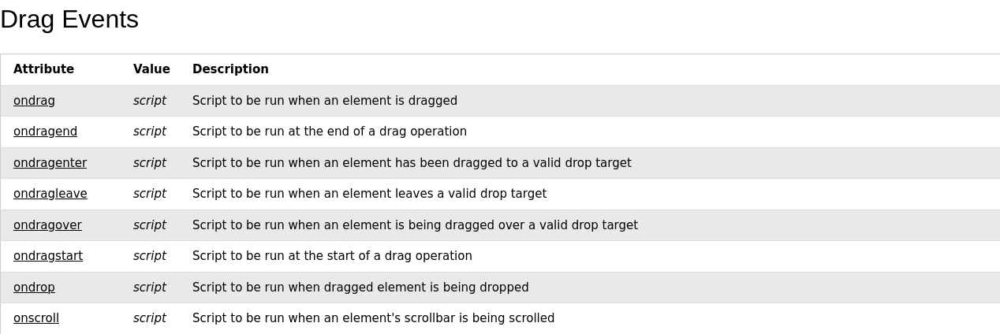
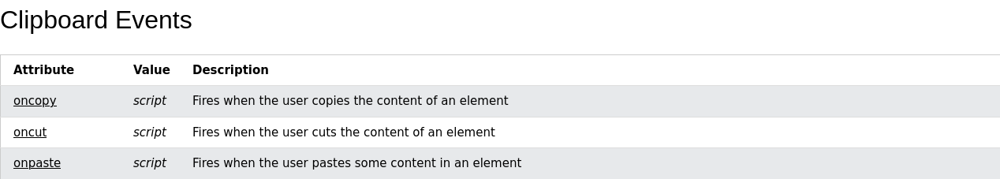
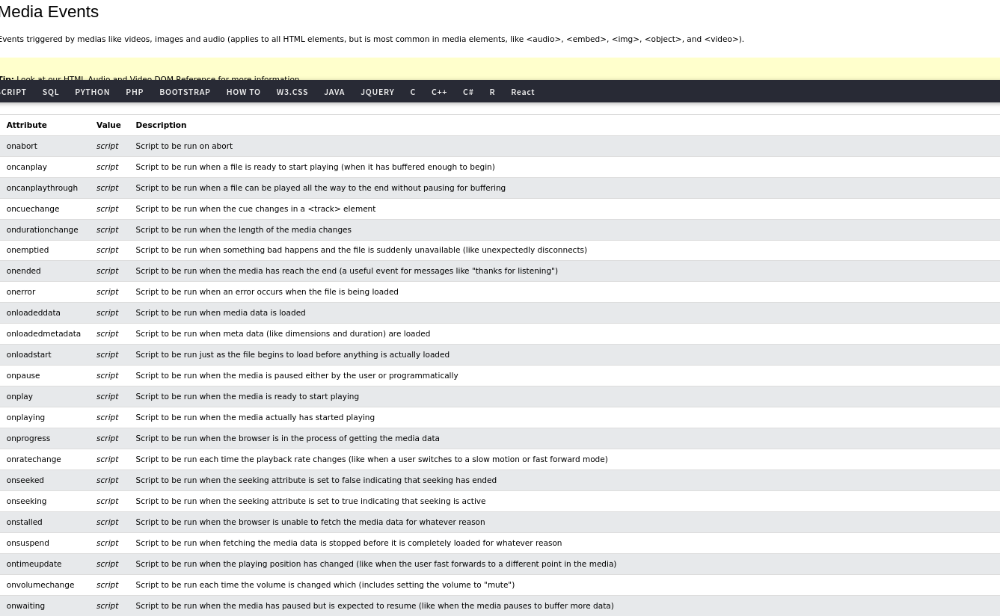

# Interativity

- Adding js to add actions to our HTML/CSS elements.
- Javascript is used to control our components in html.

## Buttons with divs

- To create a button we follow the sytax
- `onclick` is an event in which we call our JS function in ""

```HTML
    <input type="button" value="change" onclick="doChange()">

```

## Accesing HTML elements with JS

- We usually access element by id.
- .className to add a class.
- .innerHTML to access the text within that element

## Canvas

- Use to store images
- Special methods need to be used to put text in a canvas
- A container for graphics
- You need to get the context from the canvas to modify it in JS.
- `variable.getContext("id")`
- .fillStyle="Color"
- .fillRect(x, y, w, h)
- .font = "90px Arial";
- .fillText("Text", x, y)

## Input

- There're plenty types of input, which help us accomplish different things, but there main prupose is to take some sort of input from the user.

  1. text
  2. password
  3. submit: used in a form to submit all the fields.
  4. reset: used in a form to reset all the fields.
  5. radio: they let users select only one option of n options.
  6. checkbox: they let the users selecto zero or more options.
  7. button
  8. color
  9. date
  10. email
  11. file: defines a file-select and a browse button
  12. hidden: defines a hidden input which cannot be seen by users.
  13. number
  14. range: defines a control for entering a number whose exact value is not important
  15. search: regilar text field
  16. tel

## Event

- They let events trigger actions in a browser.

### Window Event



### Form Events



### Keboard Events



### Mouse Events



### Drag Events



### Clipboard Events



### Media Events


